<div align="center">



</div>

<br/>

### `$ cat about.md`

> I'm a developer interested in the space between software, games, automation, and AI.
>
> I like taking ideas from a rough concept into something functional, polished, and worth using.

```
def build(idea):
    return ship(experiment(prototype(idea)))
```

<br/>

### `$ ls ./what-i-do`

```
./what-i-do
├── game-dev/           → Unity, C#, gameplay systems, prototyping
├── software/           → Python, APIs, automation, scraping
├── web/                → JS, PHP, WordPress, responsive UI
├── data-pipelines/     → aggregation, structured processing, scheduled jobs
└── ai-systems/         → LLM integration, prompt engineering, workflows
```

<br/>

### `$ cat ./projects/dayereh.md`

<table>
<tr>
<td width="70" valign="middle">

</td>
<td valign="middle">

**Dayereh (دایره)** — a personal news aggregation and intelligence platform.

</td>
</tr>
</table>

> Collects, processes, normalizes, and presents news from multiple sources through an automated pipeline — RSS feeds, Telegram sources, media processing, and AI-generated summaries, tied together with scheduled workflows.

<a href="https://github.com/ch3fferson/dayereh"></a>

<br/>

<div align="center">
<sub><code>chefferson@github:~$</code> exit</sub>
<br/>
<sub><code>logout</code></sub>
</div>
